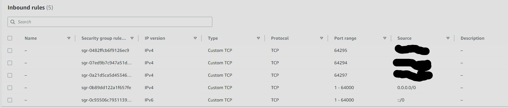
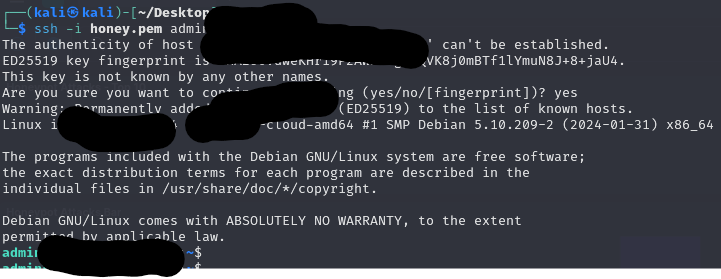

# T-Pot Honey Platform


## Overview

Deployment of T-Pot Honeypot in AWS

## Tools Used

- **AWS**: Used an EC2 instance to host the honeypot.
- **VirtualBox**: Kali Linux virtual machine to SSH into the host.
- **T-Pot platform**: all in one honeypot platform


## Deployment Steps


### EC2 Instance
- AMI: Debian 11
- Instance type: t3.large cost: 0.0832 USD/hr
- Storage: 128 GB


### Inbound rules

- Ports 64294, 64295, 64297 will be sourced to MyIP. This allows access to the T-pot management platform after install.

- Ports 1-64000 lures the attackers in



### Connect to Instance via Virtual machine

SSH into instance using private key. ssh -i [private key path] admin@[instance public ip]


# T-Pot Install

### Git install
```bash
sudo apt update -y

sudo apt install git -y
```

### T-Pot Install
```bash
    git clone https://github.com/telekom-security/tpotce
    cd tpotce/iso/installer/
    sudo ./install.sh --type=user

```

# Kibana Dashboard


- Top attack was Dionaea
- Panama had the most attacks by a country.
- CVE -2020-11899

